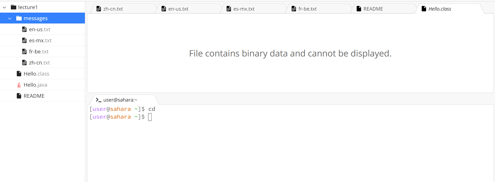
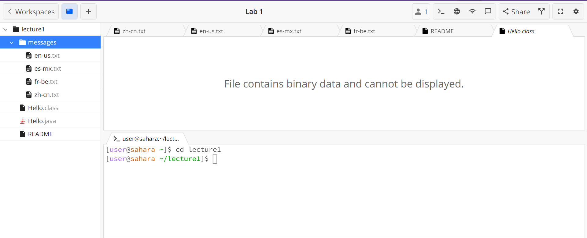
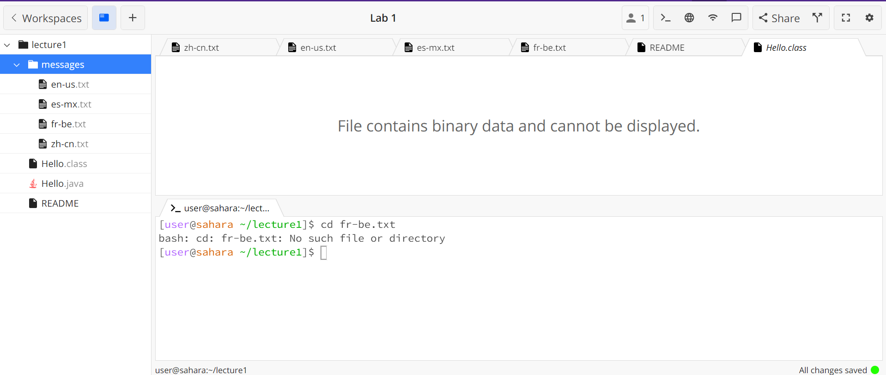

## Lab Report 1 - Remote Access and FileSystem (Week 1)

# Using command cd
*Example One:*

1. The working directory when this command was run was /home. 
2. We got this output because the command was able to run in the terminal and there were no errors.
   However, nothing was changed by us putting in the cd command.
3. This output is not an error because cd changes the directory. The only reason nothing happened
   was because there was no argument.  

*Example Two:* 

1. The working directory when this command was run was /home but was changed to
   /home/lecture1 when we ran cd with an argument.
2. We got this output because with the argument of lecture1 the directory was changed.
3. This output was not an error because the command effectively changed the directory based
   on the argument.
   
*Example Three:*

1. The working directory when this command was run was /home.
2. We got this output because the cd command doesn't take in a file name to
   change the working directory.
3. This output was an error because the correct input was not given along with the cd command. 

# Using command ls
*Example One:*

*Example Two:* 

*Example Three:*

# Using command cat
*Example One:*

*Example Two:* 

*Example Three:*

