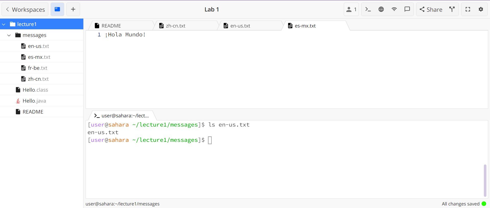

## Lab Report 1 - Remote Access and FileSystem (Week 1)

# Using command cd
*Example One:*

1. The working directory when this command was run was /home. 
2. We got this output because the command was able to run in the terminal and there were no errors.
   However, the directory was not changed by us putting in the cd command wwithout an arg.
3. This output is not an error because cd changes the directory. The only reason nothing happened
   was because there was no argument.  

*Example Two:* 

1. The working directory when this command was run was /home but was changed to
   /home/lecture1 when we ran cd with an argument.
2. We got this output because with the argument of lecture1 the directory was changed.
3. This output was not an error because the command effectively changed the directory based
   on the argument.
   
*Example Three:*

1. The working directory when this command was run was /home.
2. We got this output because the cd command doesn't take in a file name to
   change the working directory.
3. This output was an error because the correct input was not given along with the cd command. 

# Using command ls
*Example One:*

1. The working directory when the ls command was run is /home.
2. We got the output "lecture1" because this is in the content of the /home directory
   and ls lists the working directory's files and directories.
3. This was not an error because the ls command gave the correct output when we ran
   it in the terminal.

*Example Two:*

1. The working directory when this command was run in the terminal
   was /home/lecture1. 
2. We got this output because when we put ls into the terminal when the working directory
   was /lecture1 it outputs all the files and directories within this directory. So, this is
   why it outputs "Hello.class  Hello.java  messages  README" into the terminal.
3. This was not an error because the ls command effectively fulfilled its purpose and outputted
   the content of the working directory.

*Example Three:*

1. The working directory when this command was run was /home/lecture1.
2. We got this output because the correct argument was not inputed into the terminal
   along with ls. 
3. This was not an error because the ls command can only take in a directory to output its
   contents. 

# Using command cat
*Example One:*

1. The working directory when we ran this command was /home.
2. When we ran the cat command in the terminal it kept infinitly running because it did
   not receive any input. So we got the output of nothing because the terminal was still 
   waiting for an input. To stop this I used the ctrl+c command to force a stop.
3. This was not an error because this is what happens when we enter cat into the terminal
   without any arguments. 

*Example Two:* 

1. The working directory when we ran this command was /home.
2. We got this output because when we input "cat lecture1" into the terminal the cat
   command reads the the input and will output the file's content.
3. This was not an error because the cat command was able to execute correctly based on
   our input into the terminal.

*Example Three:*

1. The working directory when we ran this command was /home.
2. We got this output 
3. This was not an error because the cat command can only read 

