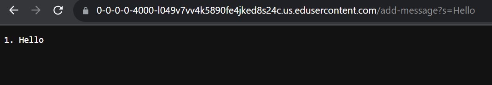
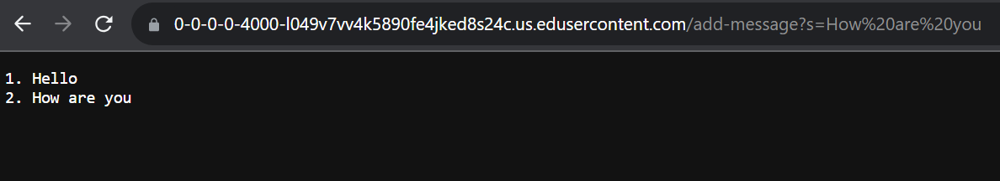
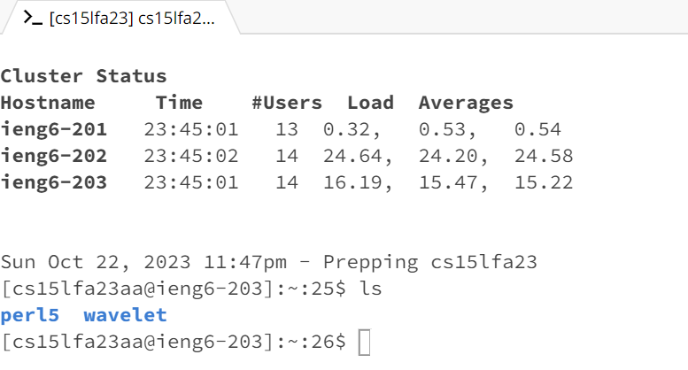

## Lab Report 2 - Servers and SSH Keys (Week 3)

# Part 1

1. The handleRequest method in the Handler class was called.
2. The URI object representing the URL path is passed as an argument
   to handleRequest. The URL for this request is /add-message?s=Hello.
3. There were two changes to the values of the relevant fields for this
   request. Firstly, message StringBuilder is initially empty but after
   processing the request, it contains "1. Hello" since this is the first
   message added. Then messageCount is also changed as it was 0 initially
   but got incremented to 1 because this is the first message.

1. The handleRequest method in the Handler class was called.
2. The URI object representing the URL path is passed as an
   argument to handleRequest. The URL for this request is
   add-message?s=How%20are%20you. Based on my implementation
   of the decoder it is able to convert the %20 into spaces.
3. The message StringBuilder contains "1. Hello" from the previous
   request and after processing this request, it contains 
        1. Hello
        2. How are you
  Then the messageCount was changed from 1 from the previous request and
  incremented to 2 for the new message.

# Part 2

# Part 3
1. Something new that I learned is how to build a server and how to log in
   to a private server. I think these are very valuable skills to learn
   as for some internships they have you work on remote private servers.
   So I am glad I was able to learn these skills and will implement them
   in the future. 

