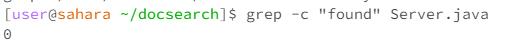
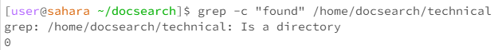
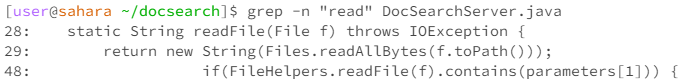
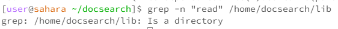
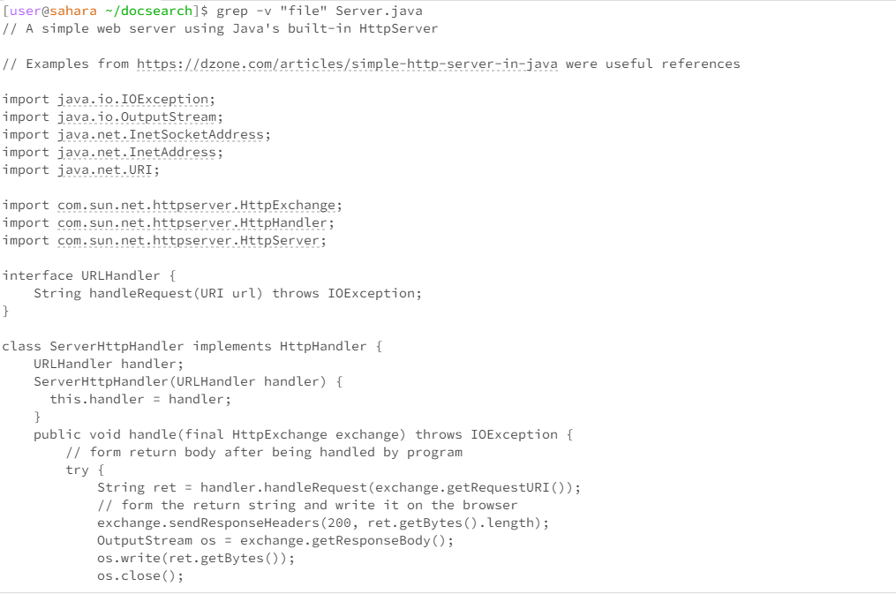
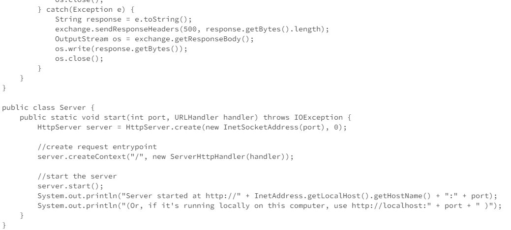
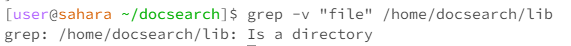
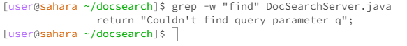
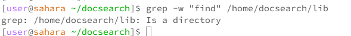

# Lab Report 3
## Part 1

### Bug Chosen
```
reverseInPlace
```

### The Bug Inducing Input
```
  @Test
  public void reverseInPlace() {
    int[] input2 = {1,2,3};
    ArrayExamples.reverseInPlace(input1);
    assertArrayEquals(new int[]{3,2,1}, input2);
  }
```

### A Working Input
```
	@Test 
	public void testReverseInPlace() {
    int[] input1 = { 3 };
    ArrayExamples.reverseInPlace(input1);
    assertArrayEquals(new int[]{ 3 }, input1);
	}
```
  
  ### Symptom of the Input
```
Time: 0.012
There was 1 faliure:
1)reverseInPlace(ArrayTests)
java.langAsseritionError: Use assertEquals(expected, actual, delta) to compare floating-point numbers
	at org.junit.fail(Assert.java:89)
	at org.junit.AssertEquals(Assert.java:669)
	at org.junit.AssertEquals(Assert.java:657)
	at org.junit.reverseInPlace(ArrayTests.java:26)

FALIURES!!!
Tests run 5, Faliures:1
```

  ### The Bug Before and After Change
#### Before Change:
```
  static void reverseInPlace(int[] arr) {
     for(int i = 0; i < arr.length; i += 1) {
       arr[i] = [arr.length - i - 1];
     }
   }
```

#### After Change:
```
  static void reverseInPlace(int[] arr) {
    int length = arr.length;
    for (int i = 0; i < arr.length; i++) {
        int temp = arr[i];
        temp = arr[length - i - 1];
        arr[length - i - 1] = temp;
    }
}
```

  ### Fixing the Bug
To fix this bug I created a new temporary array to store the values
being reversed. Then I set the index of the old array to the values 
stored in the temporary array and this resolved the issue. 

## Part 2

### Example 1


The -c command with a file will count the number of occurances of the 
string in the file. This command could be very useful for counting the 
number of error messages or how many times a certain command is called.

### Example 2


The -c command with a directory will not allow the command to work 
properly. 

### Example 3


The -n command with a file will find the associated line number. 
This is useful for finding something you need to delete from the
file. 

### Example 4


The -n command with a directory will not allow the command to work 
properly. 

### Example 5




The -v command will output the lines where the string will not appear.
This is useful for checking where certain commands or files are used
in the code. 


### Example 6


The -v command with a directory will not allow the command to work 
properly and will simply output that it is a directory.

### Example 7


When used with a file, the -w command will find the where the specific
string is located in the file. This is why it outputed "Couldn't *find*
query parameter" when we asked it to find "find".

### Example 8


The -w command with a directory will not allow the command to work 
properly. 

### Sources
1. To find the different command line options I used the article called "Grep Command in Linux – Usage, Options, and Syntax Examples" by freeCodeCamp.


