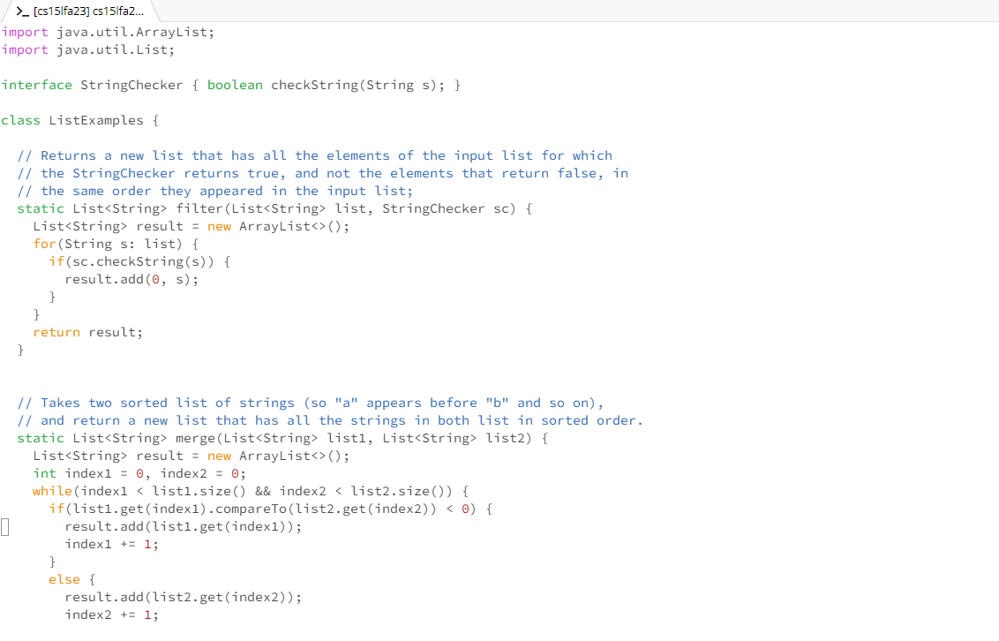
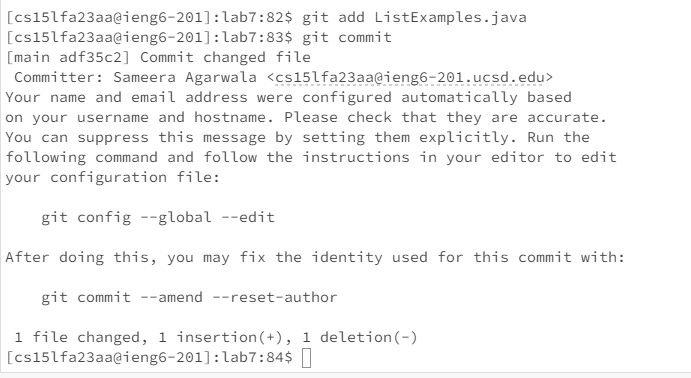

1. The ```ssh cs15lfa23aa@ieng6.ucsd.edu``` command will help us log into the remote connection to the remote computers located in ieng.ucsd.edu. This helps access the files and directories in these computers.


2. We use ```git clone https://github.com/s-samsam225/lab7.git``` <enter> to clone the fork of the repository we made into the remote server.


3. We will then use ```cd lab7``` <enter> to change the current working directory to lab7 where the files are located.
   

4. Then we run ```bash test.sh``` <enter> to tun the test.sh script which stores the junit tests.
 

5. ```vim ListExamples.java``` <enter> will then open ListExamples.java in the vim editor so we can edit the file and fix any bugs.
 

6. To fix the bug we will navigate the file by using ```PgUp``` to go up 6 times, so up, up, up, up, up, up. Once we are on the ```//change index1 below to index2 to fix test``` we use ```<1><e>``` to move to the first word on the line. Then we will navigate to the right by using ```<end>``` 4 times and go into insert mode by pressing ```<i>```. Once we are in insert mode we can press ```<2>``` to insert it into the line and change it to index2 += 1. Then we press ```<esc>``` to return back to normal mode and ```<shift> + <:> + <w> + <q>``` to quit and save our file.
   
   
7. Now we use ```bash test.sh``` again to rerun the script with the changed files. 
 
8. To commit the file we use ```git add ListExamples.java```. This will add the java file to the files waiting to be comitted. ```git commit``` <enter> will then commit all the files in the queue and takes us to the commit page to write the commit message. We can write any commit message and press <enter> to save and exit the file. I used "Commit changed file"
     
