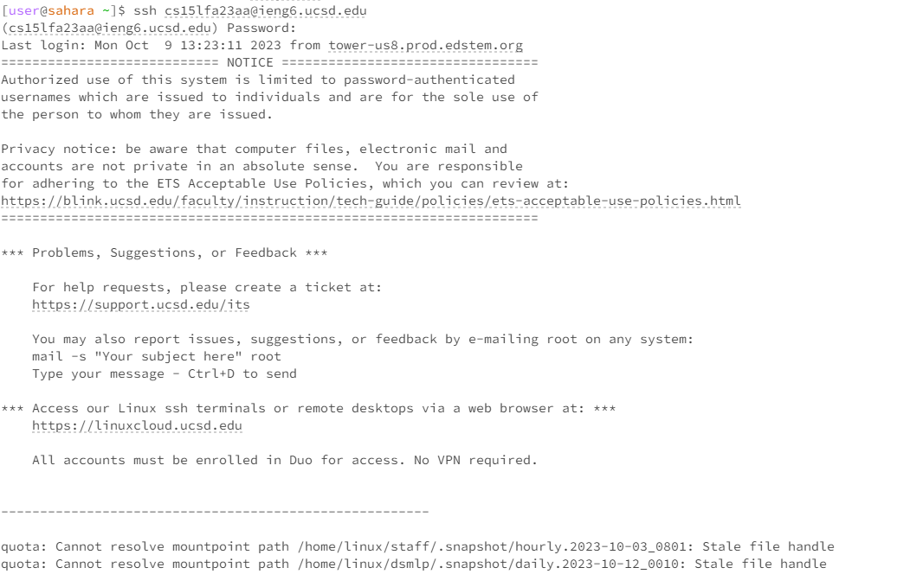
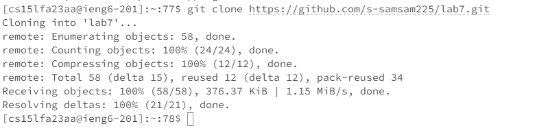
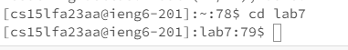
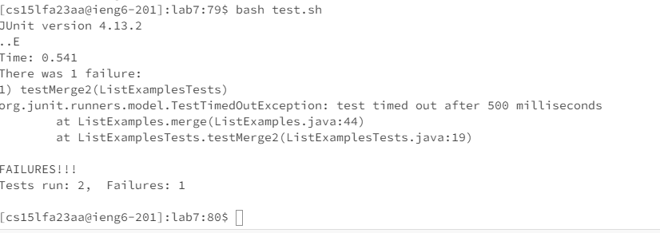
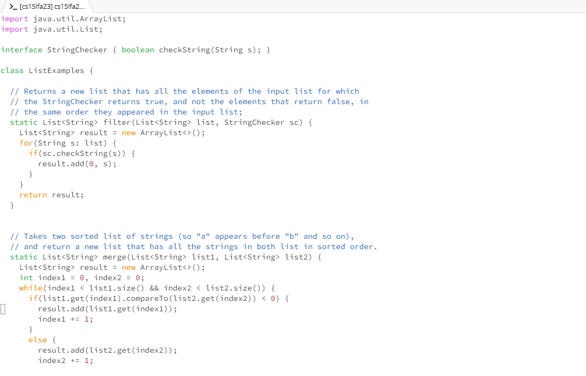

1. The ```ssh cs15lfa23aa@ieng6.ucsd.edu``` command will help us log into the remote connection to the remote computers located in ieng.ucsd.edu. This helps access the files and directories in these computers.



2. We can use git clone https://github.com/s-samsam225/lab7.git <enter> to clone the fork of the repository we made into the remote server.


3. We will then use cd lab7 <enter> to change the current working directory to lab7 where the files are located.
   

4. Then we run bash test.sh to tun the test.sh script which stores the junit tests.
 

6. vim ListExamples.java <enter> will then nopen ListExamples.java in the vim editor so we can edit the file and fix any bugs.
 

8. 
