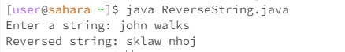

Title: String Reversal Issue

Student Post:
Hi everyone,

I'm working on a Java program for my assignment, and I'm getting some really weird output. I've attached a screenshot below. 
The program is supposed to take an input string and reverse it, but as you can see, the output is not what I expected.

Screenshot: 

Here's a snippet of my code:

```
import java.util.Scanner;

public class ReverseString {
    public static void main(String[] args) {
        Scanner scanner = new Scanner(System.in);
        System.out.print("Enter a string: ");
        String input = scanner.nextLine();
        String reversed = reverse(input);
        System.out.println("Reversed string: " + reversed);
    }

    private static String reverse(String input) {
        StringBuilder reversed = new StringBuilder();
        for (int i = input.length() - 1; i > 0; i--) {
            reversed.append(input.charAt(i));
        }
        return reversed.toString();
    }
}
```

TA Response:
Hi there,

Thanks for providing the details and the screenshot. It seems like your reverse function is not handling the first character of the string correctly.

The issue might be related to the loop condition in your `reverse` function. You currently have `for (int i = input.length() - 1; i > 0; i--)`. This condition might cause you to miss the first character in the reversal process.

To investigate further, could you try modifying the loop condition to `for (int i = input.length() - 1; i >= 0; i--)` and run the program again? This change ensures that the loop includes the first character. Let me know if this resolves the issue or if you observe any other changes in the output.

Looking forward to your update!

Student Response:

Screenshot: 


