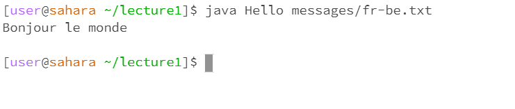

*Hello World*

**Hello World**

# Hello World

## Hello World

[Link to Google](https://www.google.com/)

>Hello World

Hello World:
---

`Hello World` with backticks



#This is a list of animals
1. Cat
2. Dog
3. Bat

#This is a list of colors
* Red
* Purple
* Yellow

```
#  Block of Code
print '3 backticks or'
print 'indent 4 spaces'
```
